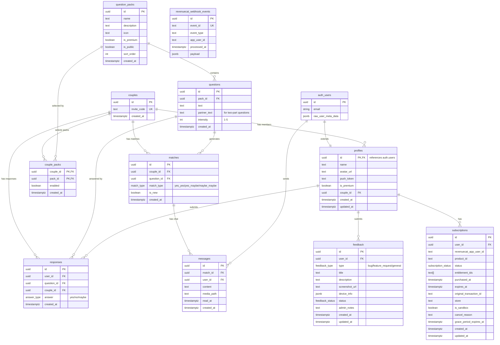

# Database Schema

## Entity Relationship Diagram

## Enums

| Enum | Values |
|------|--------|
| `answer_type` | `yes`, `no`, `maybe` |
| `match_type` | `yes_yes`, `yes_maybe`, `maybe_maybe` |
| `feedback_type` | `bug`, `feature_request`, `general` |
| `feedback_status` | `new`, `reviewed`, `in_progress`, `resolved`, `closed` |
| `subscription_status` | `active`, `cancelled`, `expired`, `billing_issue`, `paused` |

## Key Flows

### Response & Match Flow
1. User submits response via `submit-response` edge function
2. Response saved to `responses` table (UPSERT on `user_id, question_id`)
3. Function checks for partner's response on same question
4. If both answered positively (not "no"), a `match` is created
5. Match triggers push notification to both partners
6. Match unlocks chat thread in `messages` table

### Couple Pairing Flow
1. First user creates couple, gets `invite_code`
2. Second user joins via `manage-couple` edge function with invite code
3. Both profiles' `couple_id` set to same couple

### Pack Selection Flow
1. Couples can enable/disable packs via `couple_packs` junction table
2. `get_recommended_questions()` function filters questions by enabled packs
3. Two-part questions show `partner_text` to second responder
